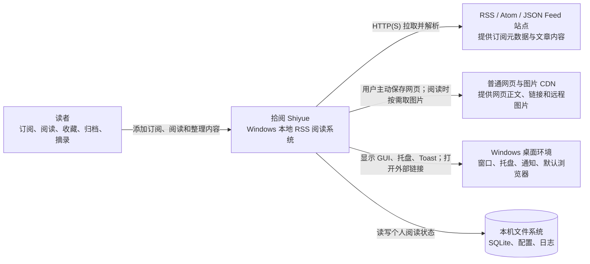
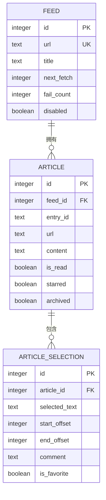
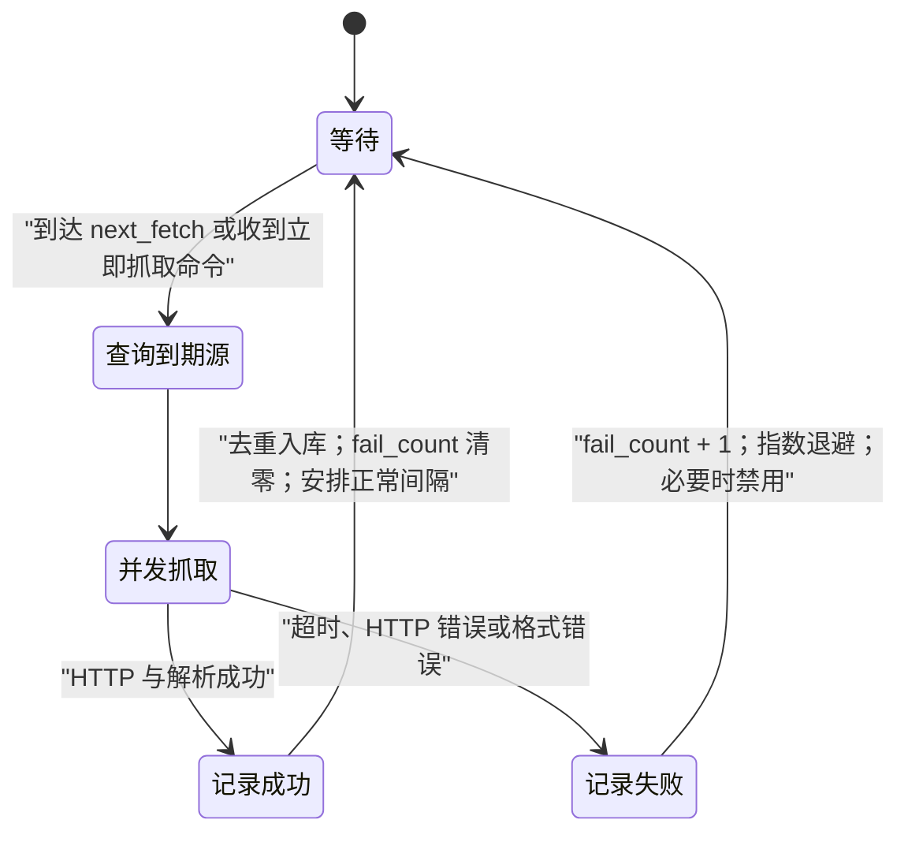
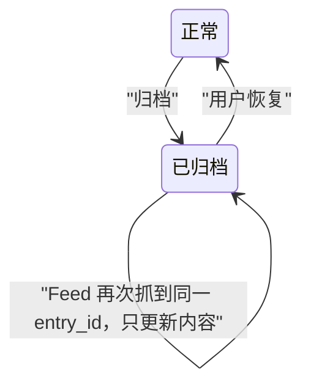
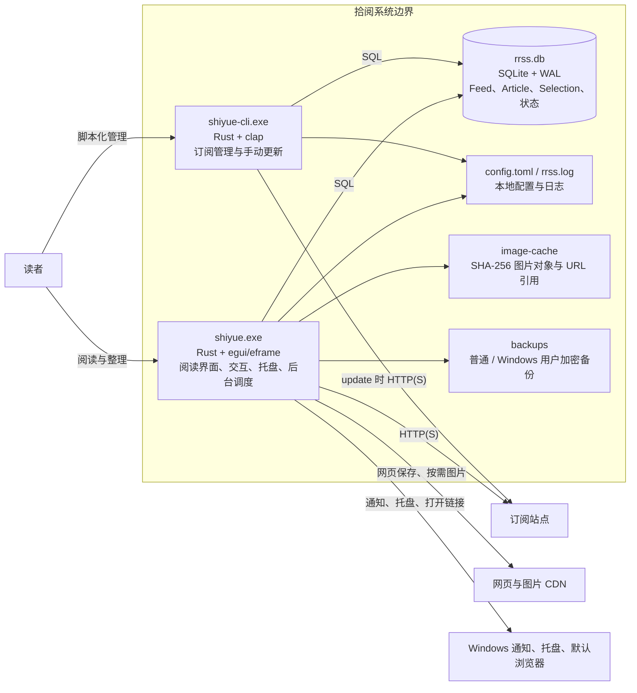
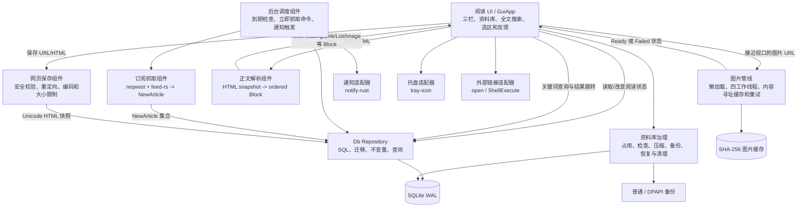
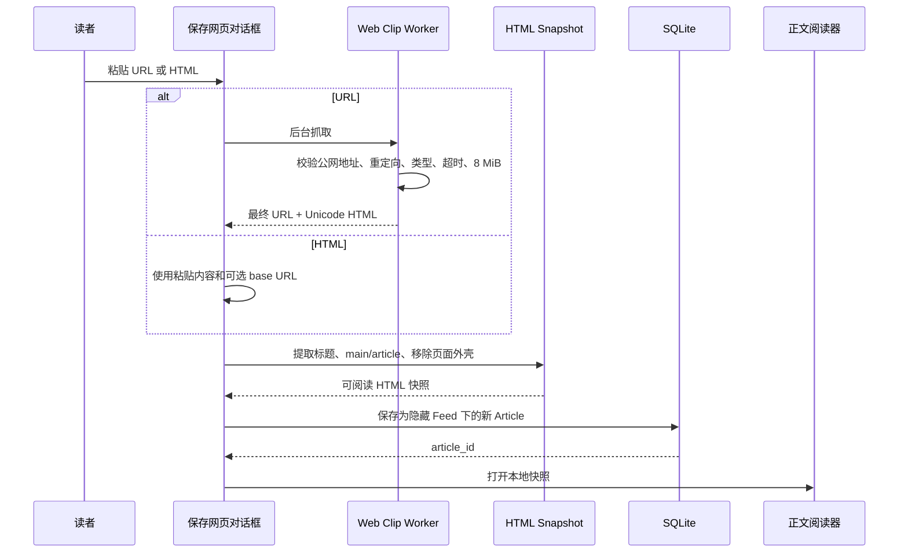
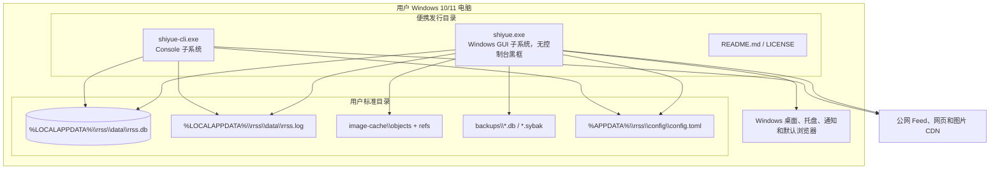

# 拾阅 Shiyue：从 RSS 问题到桌面阅读器架构视图

来源：[拾阅 GitHub 仓库](https://github.com/idkwhatimdoing62/shiyue-rss)、项目内的[架构决策记录](../rrss/docs/adr.md)、[术语表](../rrss/docs/glossary.md)和实际代码；方法参考 [How to Design Programs, Second Edition](https://htdp.org/2024-11-6/Book/part_preface.html) 与 [C4 Model](https://c4model.com/introduction)。

## 记录目的

这份笔记说明“拾阅”为什么存在、当前解决什么问题、数据怎样组织、关键操作怎样改变状态、代码怎样分工，以及这些决定如何落到 C4 架构视图中。

它不是安装说明，也不只列功能。README 回答“用户怎样使用”，代码回答“功能怎样实现”；这份笔记连接两者，记录从问题到架构的推导过程，并把已经实现、历史演化和暂未支持的内容分开。

## 设计顺序

全文沿用下面七步：

1. 重新表述阅读问题，明确系统边界；
2. 定义订阅、文章、网页快照和摘录的数据关系；
3. 写清抓取、阅读、收藏、归档和摘录的状态变化；
4. 划分 GUI、调度、抓取、解析、存储和通知职责；
5. 说明网络失败、图片失败、坏订阅源和本地数据的处理方式；
6. 回顾从 TUI 到桌面 GUI、从独立守护进程到单进程的架构选择；
7. 用 C4 Context、Container、Component 和部署图说明当前架构。

## 1. 重新表述问题与系统边界

### 1.1 为什么做拾阅

RSS 解决“信息从哪里来”，却没有自动解决“怎样舒服地读”。真实订阅内容经常有下面的问题：

1. 正文是结构不稳定的 HTML，段落、标题、列表、引用和图片容易错位；
2. 长文章里的图片很多、很大或来自不稳定的 CDN，一次全下会卡，失败后又缺少反馈；
3. 用户读到有价值的内容时，希望立刻收藏文章、摘录一段话或记下想法，而不是再搬到另一个工具；
4. 已经读完或暂时不想看的文章需要归档，而且下次刷新不能重新冒出来；
5. 有些值得保存的内容不是 RSS 条目，而是普通网页、专题页或文章索引；
6. 阅读器需要在后台更新订阅，却不应该要求用户另外维护一个守护进程；
7. 阅读记录、收藏和想法属于个人数据，优先保存在本机。

拾阅把问题重新表述为：

> 在 Windows 上提供一个本地优先的桌面阅读空间，持续收集 RSS/Atom 内容，将不稳定的 HTML 转成稳定的阅读结构，并让文章收藏、网页保存、摘录、想法和归档都发生在同一条阅读链路中。

### 1.2 目标

1. **降低获取成本**：后台按计划更新订阅，发现新文章后写入本地库；
2. **提高阅读完整度**：保留标题层级、正文顺序、链接、引用、代码、列表和图片；
3. **控制等待感**：网络抓取与图片下载不阻塞 GUI，长文章只在滚动接近图片时下载；
4. **形成个人资料库**：同一处查看收藏文章、保存网页、摘录和想法，并能跨类型找回内容；
5. **保持数据可控**：核心状态写入本机 SQLite，升级软件不迁走既有数据；
6. **限制故障扩散**：一个坏订阅源或一张坏图片不能拖垮整轮更新或整篇文章。

### 1.3 当前范围

已经实现：

- RSS、Atom 等订阅源的添加、删除、启用、禁用和更新；
- 三栏式 Windows 桌面阅读界面；
- HTML 正文清洗和语义块渲染；
- WebP、PNG、JPEG、GIF 图片懒加载、并发下载、重试和手动重载；
- 已读、未读、文章收藏、网页保存、归档和恢复；
- 跨段文字选择、复制、摘录和写想法；
- 基于 FTS5 的统一全文搜索，覆盖文章、网页快照、摘录和想法，支持相关性排序、命中高亮、搜索历史、`Ctrl + F` 和结果跳回原文；
- 文章标签、独立“稍后读”队列，以及批量收藏、批量加入稍后读和批量归档；
- 摘录保存字符偏移与前后文稳定锚点，正文更新后仍会重新定位原文；
- 后台定时抓取、失败退避、自动禁用、桌面通知和托盘驻留；
- `shiyue-cli.exe` 命令行管理工具；
- 保存普通网页 URL 或直接粘贴 HTML，并在本地保留正文快照；
- 远程图片首次加载后进入 SHA-256 内容寻址缓存，相同内容去重保存并支持后续离线阅读；
- 资料库占用统计、图片缓存清理、数据库完整性检查、压缩、备份和恢复；
- 恢复前强制创建安全副本，并可用当前 Windows 用户凭据加密可搬运备份。

#### 已完成的阅读完整度

在列表、链接图片、脚注和代码语言支持之上，当前已经完成：

- 使用内嵌 MathJax + Boa 把 TeX 排版为 SVG；排版在线程中进行，失败时仍保留可复制的公式源文本；
- 将 `picture/srcset` 归一为单张响应式图片，并保留 `figcaption` 与 `dl/dt/dd` 语义；
- 表格模型保留 `rowspan/colspan`，渲染和快照共用逻辑列放置算法；
- 新增包含响应式图片、图注、定义列表和复杂表格的组合 fixture；
- 新增可直接打开检查的 SVG 视觉快照，并与结构断言一起回归；
- 用 `scraper/html5ever` 和 `dom_smoothie` 跑通候选解析对比，结论记录在 `docs/html5-readability-evaluation.md`；
- 将 `scraper/html5ever` 接入完整网页快照的生产路径，用浏览器级 DOM 替换原先最脆弱的 `main/body/article` 字符串边界匹配；
- 仅当完整页作用域中恰好存在一篇 `article` 时运行 Readability；RSS 片段直接进入语义块解析，多文章专题/索引页保留整个 DOM 作用域；
- 为 Readability 增加正文纯度和语义完整度门禁：正文必须完整保留且不能明显增加范围外文字，图片、图注、定义列表、表格跨度、列表、链接、代码和公式数量均不得回退；
- Readability 解析失败或未通过门禁时自动使用 HTML5 DOM 结果，不把候选失败暴露给阅读界面；
- 新增畸形 HTML5 修复、RSS/索引隔离、公式丢失回退和生产门禁通过测试；
- 用 HTML5 DOM 节点删除替换忽略元素清理的手写标签范围，并单独保留 `math/tex` 公式脚本；
- 标题、`base href` 与 `picture/srcset` 已迁移为 DOM 选择器、属性读取和节点归一；
- 新增 Rust Blog 无标准 `article` 的完整页，以及 Simon Willison 风格畸形正文 fixture；
- 上述迁移没有修改语义 Block 和 GUI 渲染接口，RSS 片段仍从原入口进入解析。

#### 已完成的离线与数据治理

- 图片 URL 只作为引用，图片字节按 SHA-256 保存；多个 URL 返回相同内容时共用一个对象；
- 图片工作线程先查本地缓存，再访问网络；缓存对象会校验摘要，损坏对象自动丢弃并重新下载；
- 图片缓存默认限制 1 GB，按 URL 引用的最近使用时间淘汰，并清扫不再被引用的对象；
- SQLite 使用在线备份接口生成一致副本，备份完成后立即执行完整性和外键检查；
- 数据库恢复前先生成独立安全副本，源备份校验通过后才允许覆盖；订阅更新线程在恢复与 `VACUUM` 期间暂停写入；
- 左栏“资料库管理”显示数据库、图片、备份和日志占用，支持收缩或清空图片、保留最近 10 份备份以及打开资料目录；
- 可选的 Windows 用户加密备份使用 DPAPI，临时明文即使加密失败也会清除；实时数据库仍是普通 SQLite，不把备份保护误称为透明数据库加密。

明确暂未支持：

- OPML 导入导出；
- 账号、云同步和多设备合并；
- 标签关系的知识图谱；
- macOS、Linux、移动端和浏览器端；
- 多用户协作、评论共享和服务端管理后台。

### 1.4 输入、输出与状态变化

| 类型 | 输入 | 输出或状态变化 |
| --- | --- | --- |
| 订阅管理 | Feed URL、启停命令、抓取间隔 | 新建或更新 Feed；记录下一次抓取时间 |
| 定时事件 | 当前时间到达 `next_fetch` | 拉取源、解析条目、写入新文章、更新未读数 |
| 阅读操作 | 选择源、文章、滚动、点击链接 | 展示正文；文章变为已读；按需加载图片 |
| 文章收藏 | 点击“收藏文章” | `starred` 切换；文章进入或离开“文章收藏” |
| 网页保存 | URL 或 HTML | 生成不可覆盖的本地文章快照，进入“文章收藏” |
| 摘录与想法 | 正文选区、想法文字 | 新建或更新 `ArticleSelection` |
| 全文搜索 | 标题、作者、正文、网址、摘录或想法中的关键词 | 返回分类型的命中摘要；点击后打开所属文章 |
| 标签 | 逗号或换行分隔的标签名 | 原子替换文章标签集；标签进入搜索索引 |
| 稍后读 | 文章 id、目标状态 | 独立切换 `read_later`；不改变已读或收藏状态 |
| 批量操作 | 文章 id 集合、明确目标动作 | 同一 SQL 语句设置收藏、稍后读或归档目标状态 |
| 归档 | 文章 id | `archived = true`；普通列表与收藏列表隐藏该文章 |
| 恢复归档 | 已归档文章 id | `archived = false`；重新出现在原订阅源中 |
| 网络失败 | 超时、非成功状态、解析失败 | 保留旧数据，记录错误和失败次数，延后再试 |

### 1.5 约束

1. **平台**：当前面向 Windows 10/11；
2. **单机**：没有服务端，数据库、配置和日志都在用户目录；
3. **兼容历史数据**：公开名称已改为“拾阅”，但继续读取早期 `rrss` 数据目录和应用 id；
4. **GUI 主线程不能阻塞**：订阅抓取、网页保存和图片下载都要离开 UI 主线程；
5. **外部内容不可信**：网页地址、重定向、Content-Type、HTML 大小和图片大小都要检查；
6. **来源格式不统一**：解析器必须允许内容缺标题、缺作者、缺日期、缺 URL 或包含不规范 HTML；
7. **便携发行**：用户下载 ZIP，解压后直接双击 `shiyue.exe`，不要求安装运行时或数据库。

### 1.6 C4 系统上下文



系统边界里只有拾阅。订阅站点、普通网页、Windows 能力和文件系统都是外部依赖；SQLite 虽然由应用创建，却是一个独立的数据存储容器，在后面的 Container 图中展开。

## 2. 数据、状态与关系

### 2.1 领域语言

| 概念 | 含义 |
| --- | --- |
| Feed / 订阅源 | 一个订阅 URL 及抓取状态 |
| NewArticle / 待入库文章 | 外部条目转换后的中间模型，还没有数据库 id |
| Article / 文章 | 已入库的 RSS 条目或网页快照 |
| Web Clipping / 网页快照 | 用户保存的 URL 或 HTML；复用 Article 模型 |
| ArticleSelection / 摘录 | 文章中的一段文字，可收藏，也可附带想法 |
| SearchHit / 搜索命中 | 指向某篇 Article 的只读结果；类型为文章、网页快照、摘录或想法 |
| starred / 文章收藏 | Article 层级的收藏状态 |
| is_favorite / 摘录收藏 | ArticleSelection 层级的收藏状态 |
| archived / 归档 | 文章从日常列表隐藏，但不从数据库删除 |
| due / 到期 | `now >= next_fetch` 且源未禁用，需要本轮抓取 |
| backoff / 退避 | 抓取失败后延长下一次抓取间隔 |

这里必须区分三个容易混淆的动作：

1. **收藏文章**保存整篇 Article；
2. **保存网页**创建一个新的 Article 快照；
3. **摘录**保存 Article 中的一段 ArticleSelection。

### 2.2 主要数据结构

#### Feed

```text
Feed = {
  id,
  url,
  title?,
  interval_secs?,
  last_fetch?,
  next_fetch,
  last_error?,
  fail_count,
  disabled
}
```

`interval_secs = None` 表示使用全局默认间隔。`last_error` 与 `fail_count` 不只是日志，它们参与下一次调度和自动禁用。

#### Article

```text
Article = {
  id,
  feed_id,
  entry_id,
  url?,
  title?,
  author?,
  published?,
  content?,
  is_read,
  starred,
  archived,
  fetched_at
}
```

RSS 文章和网页快照共用 Article。网页快照归属于隐藏的内部 Feed：`shiyue://web-clippings`。这样阅读界面、收藏库、正文渲染和摘录逻辑不需要再维护第二套模型。

#### ArticleSelection

```text
ArticleSelection = {
  id,
  article_id,
  selected_text,
  start_offset?,
  end_offset?,
  comment?,
  is_favorite,
  created_at,
  updated_at
}
```

偏移量使用字符位置而不是 UTF-8 字节位置，避免中文和 Emoji 截断。选区既可以只有摘录，也可以只有想法，或两者同时存在。

#### SearchHit

```text
SearchHit = {
  kind,             // Article | WebClipping | Excerpt | Thought
  article_id,
  feed_id,
  article_title?,
  snippet,
  timestamp,
  archived
}
```

SearchHit 不单独入库，它是一次查询的只读投影。四类命中都保留 `article_id` 和 `feed_id`，因此搜索界面不需要理解正文或摘录的数据关系，也能统一跳回原文章。归档标志随结果返回，避免为了查看搜索结果而意外恢复文章。

### 2.3 对应关系



数据库的关键约束：

- `feeds.url` 唯一；重复添加同一个源返回已有 id；
- `articles(feed_id, entry_id)` 唯一；同一源重复刷新不会复制文章；
- 删除 Feed 时通过外键级联删除所属 Article 和 ArticleSelection；
- `selected_text` 不能为空；`is_favorite` 只能是 0 或 1；
- 网页快照每次生成随机 `entry_id`，即使 URL 相同，也保存为两个独立快照；
- 隐藏网页 Feed 不进入订阅列表、调度查询或删除命令。

### 2.4 文章状态不是单一状态机

Article 同时有三个正交状态：

```text
阅读状态：未读 <-> 已读
收藏状态：未收藏 <-> 已收藏
可见状态：正常 <-> 已归档
```

它们不是互斥枚举。一篇文章可以“已读 + 已收藏 + 已归档”。界面查询规则决定它出现在哪里：

| 条件 | 订阅文章列表 | 文章收藏 | 已归档 |
| --- | --- | --- | --- |
| `archived = false`、`starred = false` | 显示 | 不显示 | 不显示 |
| `archived = false`、`starred = true` | 显示 | 显示 | 不显示 |
| `archived = true` | 不显示 | 不显示 | 显示 |
| 网页快照且未归档 | 不显示在普通订阅源 | 显示 | 不显示 |

### 2.5 不变量

1. 已归档文章再次从 Feed 抓到时，更新标题和正文，但不能自动取消归档；
2. 同一 Feed 的同一 `entry_id` 最多有一条 Article；
3. 网页快照不会因为再次保存同一 URL 而覆盖旧快照；
4. 隐藏网页 Feed 永不参加网络调度；
5. 收藏切换只有数据库更新成功后才更新界面状态；
6. 删除网页快照的接口不能删除普通 RSS 文章；
7. 图片失败不能删除或隐藏它前后的正文；
8. 一个 Feed 抓取失败不能回滚其他 Feed 已经成功写入的文章。

## 3. 关键操作、状态与失败处理

### 3.1 添加订阅源

**输入**：用户提交一个 Feed URL。

**过程**：

1. `INSERT OR IGNORE` 写入 Feed；
2. 若已存在，返回原有 id；
3. 立即抓取一次，尝试补充标题并写入初始文章；
4. 首次抓取失败时保留 Feed，并记录错误，而不是撤销添加。

**结果**：用户能看到新源；成功时有文章，失败时看到错误状态，之后仍可重试。

### 3.2 定时抓取一轮



抓取契约：

- 输入是一组启用或到期的 Feed；
- 每个 Feed 在独立异步任务中拉取和解析；
- 成功结果转成 `NewArticle` 集合，再由数据库去重写入；
- 失败只更新该 Feed 的失败状态；
- 本轮返回“有新增的源数”和“新增文章总数”；
- 窗口未聚焦且新增数大于零时，可以发 Windows 通知。

边界例子：

| 情况 | 预期结果 |
| --- | --- |
| 没有到期源 | 不发请求，继续等待 |
| 一个源返回旧文章 | 写入数为 0，不重复通知 |
| 一个源坏、三个源成功 | 三个源照常入库，坏源单独退避 |
| 连续失败达到阈值 | 自动 `disabled = true`，等待用户重新启用 |
| 后台抓取完成时正在阅读 | 重读列表和未读数，但按 id 保住当前选择，不强制跳转 |

### 3.3 打开并阅读文章

1. 用户在中栏选择文章；
2. 数据库将它标为已读；
3. `content` 经 HTML 解析器转成有序 `Block`；
4. GUI 按块渲染标题、正文、链接、引用、带语言代码、嵌套列表、链接图片、表格和公式；
5. 图片只有接近可视区域时才进入下载队列；
6. 链接普通点击打开浏览器，拖动则进入跨块文字选择；
7. 当前阅读位置只影响界面，不反写 HTML。

正文块不是浏览器 DOM 的完整复制，而是为阅读设计的中间表示：

```text
Block =
  Text
  | Strong
  | Heading
  | HeadingLink
  | Quote
  | Code
  | CodeBlock(language)
  | Link
  | ListItemStart / ListItemEnd
  | Image
  | LinkedImage
  | Table
  | Math
```

这个表示保留阅读需要的结构，同时丢弃脚本、样式、导航、页头、页尾、表单和 iframe 等页面外壳。列表层级来自 `ul/ol` 容器而不是猜测 `li` 嵌套；图片位于链接或列表中时仍保留目标地址和文档顺序；普通脚本继续移除，但 `math/tex`、MathML 和常见 MathJax/KaTeX 容器会降级成可阅读、可复制的公式源文本。

### 3.4 收藏文章与保存网页

#### 收藏订阅文章

- 输入：Article id；
- 前置条件：文章存在；
- 状态变化：`starred = 1 - starred`；
- 成功结果：进入或离开左侧“文章收藏”；
- 失败结果：界面保持旧状态并显示原因。

#### 保存网页 URL

1. 校验只接受 HTTP/HTTPS，拒绝账号密码、本机和内网地址；
2. DNS 解析前检查目标，重定向每一跳再次检查，连接后再检查真实对端；
3. 连接超时 10 秒，总超时 45 秒；
4. 只接受 HTML/XHTML，或在缺少 Content-Type 时检查内容确实像 HTML；
5. 解压后的正文上限为 8 MiB；
6. 根据 BOM、HTTP charset、HTML meta 和编码检测结果解码；
7. 选择阅读范围：优先 `<main>`，若其中恰好有一个 `<article>` 则进一步缩小；多个 `<article>` 视为专题/索引页整体保存；
8. 创建新的本地 Article 快照，`is_read = true`、`starred = true`。

#### 直接粘贴 HTML

不访问网络，直接清洗并保存。若提供基础 URL，则用于补全相对链接和图片；它不作为快照的唯一键。

### 3.5 摘录与写想法

```text
选择一段文字
  ├─ 复制：只写入剪贴板，不入库
  ├─ 摘录：保存 selected_text + is_favorite
  └─ 写想法：保存 selected_text + comment，可同时收藏
```

跨段选区由多个可选择文本块共同组成。浮动工具栏只在鼠标松开、选区有效且不只是空白时显示。保存后可从“摘录与想法”跳回原文章。

### 3.6 归档与恢复

归档不是删除：



归档后：

- 普通文章列表不显示；
- 未读数不计算；
- 即使本来已收藏，“文章收藏”也不显示；
- 刷新 Feed 不会重新出现；
- 在“已归档”中仍能恢复。

### 3.7 全文搜索与结果跳转

搜索入口位于左栏，也可以按 `Ctrl + F` 打开。搜索范围包括：

- Article 的标题、作者、正文 HTML 和原始网址；
- 隐藏网页 Feed 下保存的网页快照；
- `ArticleSelection.selected_text` 中已收藏的摘录；
- `ArticleSelection.comment` 中非空的想法。

当前查询流程：

1. 去除关键词首尾空白，空关键词不访问数据库；
2. 三个字符以上的词交给 SQLite FTS5 `trigram` 索引；一至两个字符的中文短词回退到精确子串匹配；
3. 文章、网页快照、摘录和想法在索引中保留类型、来源 id 和所属文章 id，投影为统一 `SearchHit`；文章标签也合并进文章索引；
4. FTS 命中使用 `bm25` 相关性排序，再以活动时间和文章 id 稳定排序，单次最多返回 200 条；
5. FTS5 生成关键词附近摘要，GUI 继续清理 HTML，并在标题和摘要中高亮全部匹配项；中文按原字匹配，英文忽略大小写；
6. 每次非空查询去重写入 `search_history`，记录最近使用时间、使用次数和结果数；搜索窗口可复用或清空历史；
7. 点击普通文章结果，切回所属 Feed 并打开文章；点击网页快照结果，切到“文章收藏”；
8. 摘录与想法结果携带 Selection id，打开后使用稳定锚点定位到原文；
9. 点击已归档文章结果，只进入临时搜索视图，不修改 `archived`，也不把文章恢复到订阅列表。

### 3.8 图片状态

```text
未请求 -> 查询内容寻址缓存
缓存命中且摘要/格式有效 -> Ready(bytes)
缓存缺失或损坏 -> Loading(attempt = 1)
Loading -> Ready(bytes)
Loading -> Loading(attempt + 1)    可重试错误且未到 3 次
Loading -> Failed(error)           不可重试或达到 3 次
Failed -> Loading(attempt = 1)     用户点击或右键重载
```

下载限制：四个工作线程、每张最大 25 MiB、最多三次尝试。成功响应先完成图片解码校验，再写入内容寻址缓存；失败占位会显示原因，并允许重新加载或在浏览器打开原图。

## 4. 抽象、模块与接口边界

### 4.1 当前模块职责

| 模块 | 稳定职责 | 主要变化点 |
| --- | --- | --- |
| `model.rs` | 定义 Feed、Article、NewArticle、ArticleSelection、SearchHit | 新领域字段、状态和只读投影 |
| `db.rs` | Schema、迁移、全文搜索、查询、不变量和事务边界 | 新资料库、索引和迁移 |
| `image_store.rs` | URL 引用、SHA-256 图片对象、摘要校验、LRU 淘汰与无引用清扫 | 缓存限额和清理策略 |
| `backup.rs` | 普通/DPAPI 备份、备份枚举与保留策略、恢复前安全副本 | 平台凭据保护和恢复策略 |
| `fetch.rs` | 订阅 HTTP 拉取，`feed-rs` 模型转 NewArticle | Feed 格式和媒体字段 |
| `daemon.rs` | 并发抓取一批源，记录成功或失败 | 退避和批次策略 |
| `gui.rs` | 三栏 UI、交互状态、调度线程、托盘、图片队列 | 视觉、交互和阅读体验 |
| `text.rs` | 完整页 HTML5 DOM 选区、Readability 门禁、快照清洗、链接解析和语义 Block 生成 | 各网站不规范 HTML 与正文选择策略 |
| `web_clip.rs` | 安全抓取普通网页并解码为 Unicode | 网络安全、编码、体积限制 |
| `config.rs` | 标准路径、TOML 配置、时间解析 | 用户可调参数 |
| `notify.rs` | Windows 新文章通知 | 将来可增加通知渠道 |
| `cli.rs` / `lib.rs` | CLI 命令定义与 GUI/CLI 公共入口 | 命令面和发行入口 |

### 4.2 重要接口契约

#### `fetch::fetch(client, url)`

- 输入：可访问的 Feed URL；
- 输出：可选 Feed 标题和一组 `NewArticle`；
- 失败：HTTP、超时或订阅解析错误；
- 未承诺：不负责入库、去重、退避和通知。

#### `daemon::fetch_feeds(db, cfg, client, feeds)`

- 输入：一组 Feed；
- 输出：有新增的源数、新文章总数；
- 保证：每个源独立处理；成功写库，失败记状态；
- 未承诺：不决定何时调度，不直接操作 GUI。

#### `text::prepare_html_snapshot(html)`

- 输入：由网页抓取或用户粘贴得到的完整 HTML 页面；
- 输出：标题、正文 HTML 和页面声明的基础 URL；
- 保证：使用 `scraper/html5ever` 修复并查询 HTML5 DOM；优先选择 `main`、其次选择 `body`；只有作用域中恰好存在一篇 `article` 时才允许 Readability 参与正文选择；
- 门禁：Readability 候选必须完整保留正文文字，不能明显混入作用域外文字，并且不得减少图片、图注、定义列表、表格及跨度、列表、链接、代码或公式语义；任一条件不满足就回退到 HTML5 DOM 结果；
- 隔离：RSS 片段和专题/索引页不经过 Readability。

#### `text::content_blocks(html, base)`

- 输入：RSS 正文片段或已经完成正文选择的网页快照，以及可选基础 URL；
- 输出：按原文顺序排列的语义 Block；
- 保证：相对链接可补全、无效 HTML 尽量降级为可读文字；保留嵌套列表深度、链接图片目标、表格单元格、脚注引用、公式源文本和代码语言提示；
- 未承诺：不实现 CSS 布局，不执行 JavaScript，不追求像素级还原网页。

#### `web_clip::fetch_html(client, input)`

- 输入：用户主动提交的公网 HTTP/HTTPS URL；
- 输出：原始 URL、最终 URL 和 Unicode HTML；
- 保证：限制重定向、目标地址、类型、时间和体积；
- 未承诺：不绕过登录、验证码、付费墙或 JavaScript 渲染页面。

#### `Db::search_library(query, limit)`

- 输入：非空关键词和结果上限；
- 输出：按时间倒序排列的统一 `SearchHit`；
- 保证：覆盖文章、网页快照、已收藏摘录和非空想法；每条结果都能定位所属文章；
- 边界：空关键词或上限为 0 时直接返回空集合；归档文章仍可命中，但结果明确携带归档状态；
- 未承诺：当前不做分词、相关性评分、拼写纠错或跨字段权重计算。

### 4.3 变化隔离

1. Feed 格式差异在 `feed-rs -> NewArticle` 边界被消化，GUI 不读取原始 XML；
2. HTML 差异在 `HTML -> Block` 边界被消化，渲染层不直接遍历标签字符串；
3. 数据库 SQL 集中在 `Db`，界面不直接拼 SQL；
4. 调度只通过数据库和原子标志与 GUI 协作，不共享 `rusqlite::Connection`；
5. 普通网页被转成 Article 快照，收藏库和摘录功能复用既有流程；
6. GUI 与 CLI 是两个二进制，但共享同一个 library crate 和同一份数据。
7. 搜索查询在数据库层统一投影为 SearchHit，GUI 不分别拼接文章、摘录和想法查询。

### 4.4 变更影响表

| 变化 | 主要修改位置 | 不应修改的位置 |
| --- | --- | --- |
| 支持新的 Feed 媒体字段 | `fetch.rs` | GUI 布局、数据库调度规则 |
| 改正文排版 | `text.rs`、`gui.rs` | Feed 抓取、退避算法 |
| 增加 Article 字段 | `model.rs`、`db.rs` migration/query | HTTP 客户端 |
| 新增通知渠道 | `notify.rs`、Config | HTML 解析器 |
| 支持离线图片 | 图片存储模型、下载器、DB/文件路径 | Feed 去重键 |
| 支持 OPML | CLI/GUI 导入入口、新解析模块 | 正文 Block 渲染 |
| 将搜索升级为 FTS5 | `db.rs` 查询、Schema migration 和索引 | 搜索窗口与结果跳转协议 |

## 5. 质量要求、故障边界与恢复目标

### 5.1 出错处理表

| 故障 | 外部表现 | 隔离方式 | 恢复方式 |
| --- | --- | --- | --- |
| Feed 网络超时 | 源显示错误，旧文章仍可读 | 每源独立任务；不影响其他源 | 指数退避后重试，或用户立即抓取 |
| Feed 格式错误 | 本轮无新文章，记录解析错误 | 不把半成品写库 | 源修复后重试；连续失败可自动禁用 |
| SQLite 写入失败 | 收藏/归档等操作提示失败 | 成功后才更新 UI 状态 | 检查磁盘、权限和日志后重试 |
| 网页返回非 HTML | 不保存，提示内容类型错误 | URL 抓取与现有收藏分离 | 换正确地址或直接粘贴 HTML |
| 网页过大/超时 | 保存中止，已有数据不变 | 8 MiB、10/45 秒限制 | 缩小内容或粘贴正文 HTML |
| 图片失败 | 固定占位与错误原因，正文继续显示 | 图片是独立状态；四线程有界队列 | 自动重试，用户手动重载或浏览器打开 |
| 坏 HTML | 局部排版降级 | 语义 Block 解析，不执行脚本 | 扩充解析回归测试；原文链接仍可打开 |
| GUI 关闭 | 窗口隐藏，后台继续更新 | 托盘持有进程 | 托盘重新显示；托盘“退出”才终止 |

### 5.2 质量场景

#### 场景 A：坏源不能拖垮整轮更新

- **刺激源**：某个第三方 Feed；
- **刺激**：连接超时或返回坏 XML；
- **环境**：后台同时更新多个源；
- **受影响对象**：该 Feed 的抓取任务；
- **响应**：记录错误、增加 `fail_count`、安排退避，继续处理其他任务；
- **度量**：其他源的成功文章仍写入；本轮不因一个错误 panic。

#### 场景 B：打开长文章时界面仍可操作

- **刺激源**：包含几十张远程图片的文章；
- **刺激**：用户打开并滚动；
- **环境**：普通桌面网络；
- **受影响对象**：正文渲染和图片队列；
- **响应**：先展示文字和稳定占位，接近可视区才排队下载，最多四个并发；
- **度量**：打开文章不一次发出全部图片请求，滚动和选择文字不等待网络完成。

#### 场景 C：收藏失败不能制造假状态

- **刺激源**：本机磁盘或 SQLite；
- **刺激**：写入失败；
- **环境**：用户点击收藏；
- **受影响对象**：Article 的 `starred` 和界面按钮；
- **响应**：保留原状态，显示失败原因；
- **度量**：界面不会显示“已收藏”而数据库仍未收藏。

#### 场景 D：保存网页不能访问内网

- **刺激源**：用户粘贴的 URL 或恶意重定向；
- **刺激**：目标是 localhost、私有地址、链路本地地址或文档保留地址；
- **环境**：网页保存；
- **受影响对象**：网页 HTTP 客户端；
- **响应**：DNS 前、重定向时和连接后都检查并拒绝；
- **度量**：不向被禁止地址发出有效内容请求，不生成快照。

### 5.3 可观测性与恢复

- 日志：`%LOCALAPPDATA%\rrss\data\rrss.log`；
- 数据库：`%LOCALAPPDATA%\rrss\data\rrss.db`；
- 图片缓存：`%LOCALAPPDATA%\rrss\data\image-cache\{objects,refs}`；
- 数据库备份：`%LOCALAPPDATA%\rrss\data\backups\`；
- 配置：`%APPDATA%\rrss\config\config.toml`；
- Feed 级诊断字段：`last_fetch`、`next_fetch`、`last_error`、`fail_count`、`disabled`；
- UI 反馈：更新忙碌状态、收藏/归档成功或失败提示、图片错误占位；
- 恢复手段：重新启用源、手动刷新、恢复归档、手动重载图片；资料库管理提供 SQLite 校验、压缩、备份和恢复，恢复前自动建立安全副本。

当前没有集中式遥测、崩溃上报或远程日志。对于本地优先的个人软件，这是刻意接受的限制；诊断主要依靠本地日志、数据库状态和可复现测试。

## 6. 比较方案并作出架构决策

### 6.1 阅读界面：TUI 与桌面 GUI

| 方案 | 优点 | 主要问题 | 结论 |
| --- | --- | --- | --- |
| 全屏 TUI | 依赖轻、键盘操作直接、适合终端 | 真实图片和复杂 HTML 表现差，中文长文排版受限 | 初版采用，后被取代 |
| 桌面 GUI（egui/eframe） | 真图片、自由排版、原生窗口/托盘/选择交互 | 依赖更大，即时模式 UI 状态管理复杂 | 当前选择 |

这次选择不是“GUI 更现代”，而是由核心内容形状决定：RSS 正文是 HTML，图文完整度比终端纯文本更重要。

### 6.2 后台更新：独立 daemon 与 GUI 内置调度

| 方案 | 优点 | 代价 |
| --- | --- | --- |
| 独立 daemon + 阅读进程 | 阅读器退出后仍可抓取；进程职责直观 | 用户要维护两个进程；状态协调和发行复杂 |
| GUI 单进程 + 后台线程 | 一个程序完成阅读、调度和通知；托盘体验自然 | 需要跨线程协调，窗口进程退出后不再更新 |

当前选择第二种。GUI 主线程负责 egui；后台线程创建单线程 Tokio runtime；两边分别打开 SQLite 连接，通过 WAL、channel 和原子状态协作。

### 6.3 存储：SQLite 与散文件

| 方案 | 得到什么 | 失去什么 |
| --- | --- | --- |
| JSON/Markdown 散文件 | 人能直接查看，初期简单 | 去重、关联、未读统计、迁移和并发写入困难 |
| SQLite | 唯一约束、事务、关联查询、WAL、多资料库统一 | 数据不直接可读，需要 migration |

选择 SQLite。拾阅的核心不是一篇独立文档，而是 Feed、Article、Selection 和多个正交状态之间的关系。

### 6.4 正文：内嵌浏览器与语义 Block

| 方案 | 优点 | 风险或代价 |
| --- | --- | --- |
| WebView 直接渲染原 HTML | 还原度高，CSS/网页能力完整 | 脚本、跟踪、广告和页面外壳难控制；跨段选择与本地主题难统一 |
| HTML 清洗后转语义 Block | 可控、安全、排版统一，便于图片状态和摘录 | 不是完整浏览器；要持续修复网站边界情况 |

选择语义 Block。拾阅优化的是“阅读结构”，不是复刻网站。原始链接仍保留，遇到无法表达的内容可以在浏览器打开。

### 6.5 网页保存：新建独立模型与复用 Article

网页快照最终选择复用 Article，并使用隐藏 Feed 作为所有者。收益是阅读、收藏、归档、摘录和想法全部复用；代价是数据库里存在一个不是真实订阅源的内部 Feed，因此每个调度和删除查询都必须显式排除它。

### 6.6 关键 ADR 摘要

| ADR | 当前决定 |
| --- | --- |
| ADR-3 | SQLite + WAL 作为本地状态骨架 |
| ADR-5/6 | Tokio + reqwest 并发拉取，feed-rs 归一订阅格式 |
| ADR-8 | `entry_id` 优先，数据库唯一约束完成去重 |
| ADR-11 | 失败记录、指数退避、连续失败自动禁用 |
| ADR-13 | 桌面 GUI 取代 TUI |
| ADR-14 | GUI 内置抓取和调度，独立 daemon 退役 |
| ADR-15 | 关窗进托盘，继续后台更新 |
| ADR-16 | HTML 转有序语义块，原生纹理展示图片 |
| ADR-17 | 产品名改为“拾阅”，兼容旧 `rrss` 数据 |
| ADR-18 | `shiyue.exe` 与 `shiyue-cli.exe` 双入口 |
| ADR-19 | 内容寻址图片缓存 + 可验证备份；可搬运备份使用 Windows 用户凭据保护 |

重新评估条件：

- 需要跨平台时，重新评估 Windows 字体、托盘和通知依赖；
- 需要云同步时，重新评估本地 SQLite 的标识、冲突和加密；
- HTML 边界修复成本持续升高时，比较更成熟的 Readability/DOM 解析器或受限 WebView；
- 需要数千 Feed，或现有全文搜索出现可感知延迟时，重新评估调度批次、FTS5 索引和搜索策略；

## 7. 用 C4 说明当前架构

### 7.1 C4 Container：运行单元与数据存储



这里的 Container 是两个可执行应用、一个数据库和配置/日志文件，不是 Docker 容器。GUI 与 CLI 可以分别启动，但共享标准目录下的 SQLite。

### 7.2 C4 Component：`shiyue.exe` 内部组件



几个关键边界：

- UI 不直接解析 Feed XML；
- UI 不直接执行任意网页 HTML；
- Scheduler 不持有 UI 状态，只写原子标志并请求重绘；
- GUI 主线程与 Scheduler 各自拥有 SQLite Connection；
- 图片工作线程只通过队列收发 URL 和结果。
- 全文搜索只读取本地 SQLite；结果跳转复用现有 Feed、收藏和文章选择流程。

### 7.3 关键数据流：后台更新

```mermaid
sequenceDiagram
    participant Loop as 后台调度循环
    participant DB as SQLite
    participant HTTP as Feed 站点
    participant Parser as feed-rs
    participant UI as GuiApp
    participant Toast as Windows 通知

    Loop->>DB: 查询 due_feeds(now)
    par 每个 Feed 独立任务
        Loop->>HTTP: GET Feed URL
        HTTP-->>Loop: XML/Atom/JSON Feed bytes
        Loop->>Parser: 解析并转 NewArticle
        Parser-->>Loop: title + entries
        Loop->>DB: INSERT OR IGNORE / 更新调度状态
    end
    Loop->>UI: dirty = true, request_repaint()
    alt 有新增且窗口未聚焦
        Loop->>Toast: 显示新增文章数量
    end
    UI->>DB: 重读源、未读数和文章列表
```

### 7.4 关键数据流：保存网页



### 7.5 Windows 单机部署视图



没有服务器、负载均衡和远程数据库。发布包升级只替换程序文件，用户数据留在标准目录。Windows SmartScreen 可能因为未购买代码签名证书提示“未知发布者”，可用 Release 附带的 SHA-256 核对文件。

## 8. 实现演化与经验

### 8.1 从“能抓 RSS”到“能完成阅读”

项目最初的骨架是 Feed + Article + SQLite + 抓取调度。真正决定产品体验的工作随后集中在正文：

1. 终端无法承担图片和 HTML，促使 TUI 改为 GUI；
2. 只把 HTML 转成一大段文字，会丢图文顺序和标题层级，于是引入有序 Block；
3. 一次下载所有图片造成长文卡顿，于是增加视口懒加载、有界并发和重试状态；
4. 浏览器式选区工具栏不能只跟随鼠标，需要锚定选区、支持跨块和松手弹出；
5. `（1）`、`1.`、引用链接、列表内加粗等细节说明“HTML 可读”不是一次正则替换，而是持续补充语义边界；
6. 收藏文章、保存网页和摘录原本都叫“收藏”，用户无法形成心智模型，后来拆成三个明确动作；
7. 普通文章页和 Martin Fowler Architecture 这类索引页的数据形状不同，正文提取不能总是选择最大的单个 `<article>`。

### 8.2 值得保留的设计原则

1. **先保护已有数据，再改变产品名和入口**：名称可以从 rrss 变成拾阅，但数据目录不应让用户迁移；
2. **数据库约束代替“先查再写”**：Feed URL 和 Article 去重依靠唯一约束；
3. **失败状态也是产品状态**：图片 Loading/Failed、Feed fail_count、收藏失败反馈都要显式建模；
4. **网络工作不能混入 GUI 主线程**：Feed、网页和图片各有自己的异步或工作线程边界；
5. **阅读结构优先于网页像素还原**：标题、段落、引用、链接和列表正确，比复制原站 CSS 更重要；
6. **复用领域模型前先补不变量**：网页快照复用 Article 很省代码，但必须确保隐藏 Feed 永不调度、普通文章不能被网页删除接口删掉；
7. **真实网页回归不可少**：单元测试覆盖规则，真实页面测试验证站点结构和网络行为没有偏离。

## 9. 测试与交付

当前源码包含 87 个测试入口；默认执行时 85 个通过，2 个显式联网冒烟测试忽略。覆盖：

- 配置时间解析；
- Feed 去重、失败退避、自动禁用和归档不变量；
- 网页快照、收藏库和摘录 CRUD；
- 文章、网页快照、摘录和想法的统一搜索，包含空查询、结果上限、大小写和归档语义；
- 搜索摘要的 HTML 清理、Unicode 关键词定位、长度截取，以及中英文多处关键词高亮范围；
- HTML 标题、链接、编号、嵌套列表、引用、代码语言、链接图片、表格、脚注、公式和图片顺序；
- 网页编码、大小限制、Content-Type 和内网地址拒绝；
- 图片重试策略；
- Martin Fowler Architecture 与特定 WebP 的显式联网冒烟测试；
- `tests/fixtures` 下的 Martin Fowler 卡片、阮一峰周刊富内容、Rust Blog 行内代码与无 `article` 完整页、Simon Willison 风格畸形正文、MediaWiki 公式/脚注，以及响应式图片、图注、定义列表和复杂表格的最小化真实站点回归样本；
- HTML5 DOM 对畸形文章标签的修复、DOM 节点清理和元数据读取、RSS 片段不进入 Readability、多文章索引不丢卡片，以及 Readability 丢失公式时自动回退。

标准交付检查：

```powershell
cargo fmt --check
cargo test --locked
cargo check --locked --all-targets
cargo build --release --locked --bins
```

Windows 正式包还要检查：

1. `shiyue.exe` 是 GUI 子系统，不出现命令行黑框；
2. `shiyue-cli.exe` 是 Console 子系统，终端输出正常；
3. GUI 启动后至少存活数秒，不立即闪退；
4. ZIP 顶层直接包含两个 exe、README 和 LICENSE；
5. 用 Windows `Expand-Archive` 能解压，解压后文件哈希一致；
6. GitHub Release 资产哈希与本地 SHA-256 一致；
7. 远端 CI 通过。

## 10. 后续路线

按用户价值与现有边界，后续可以分三层推进。

### 10.1 阅读完整度

- 继续收集没有标准 `article` 的单篇正文，形成可解释的正文纯度门禁后，再决定是否扩大 Readability 适用面；
- 为新增的无 `article` 与畸形正文 fixture 补充视觉快照；
- 在不改变语义 Block 和渲染接口的前提下，逐步收拢剩余流式标签解析的内部边界。

### 10.2 个人资料库

- 导出 Markdown、JSON 或 OPML；
- 基于标签与引用关系生成可导航的知识图谱。

### 10.3 平台与发行

- 代码签名，减少 SmartScreen 警告；
- 自动更新与差分发布；
- macOS/Linux 的字体、托盘、通知和数据路径适配；
- 在同步需求明确后，再设计账号、端到端加密和冲突合并，而不是直接把 SQLite 上传到云端。

## 结论

拾阅的架构不是从“选 Rust 和 egui”开始的。它从一个具体问题开始：订阅内容虽然能到达用户，却很难稳定、完整、连续地被阅读和整理。

当前系统用本地 SQLite 保存长期状态，用后台 Tokio 任务解决持续抓取，用语义 Block 控制 HTML 阅读结构，用有界图片队列控制网络等待，用 GUI、托盘和通知组成 Windows 桌面体验，再把收藏文章、保存网页、摘录、想法和归档统一到 Article 这条主线中。

这个架构接受了几个清楚的代价：它目前只面向 Windows，不是完整浏览器，没有云同步，也不能保证所有网页像原站一样显示。换来的结果是边界明确、个人数据本地保存、错误影响可隔离，并且每一次交互问题都能落回数据、状态、模块或质量场景中继续改进。
